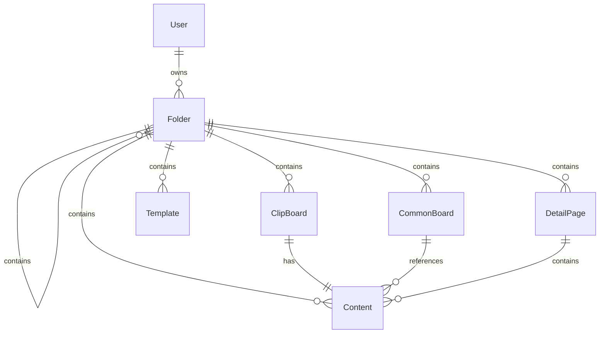

# Cursor - Andar Detail Editor 프로젝트 분석 보고서

## 📋 프로젝트 개요

**프로젝트명**: Andar Detail Editor  
**개발사**: Innerview  
**프로젝트 유형**: Node.js 웹 애플리케이션  
**주요 기능**: 상품 상세페이지 에디터 및 Cafe24 쇼핑몰 연동  

## 🏗️ 기술 스택

### Backend
- **Runtime**: Node.js
- **Framework**: Express.js 4.17.2
- **Template Engine**: Handlebars (HBS)
- **Database**: MariaDB
- **ORM**: Sequelize 6.16.1

### 인증 & 보안
- **Authentication**: Passport.js (Local Strategy, Remember-Me)
- **Password Hashing**: bcrypt
- **Session Management**: express-session
- **Encryption**: crypto-js

### 외부 연동
- **E-commerce Platform**: Cafe24 API
- **Cloud Storage**: AWS SDK
- **HTTP Client**: Axios

### 개발 도구
- **Process Manager**: PM2 (ecosystem.config.js)
- **File Upload**: Multer, express-fileupload
- **CORS**: cors middleware

## 📁 프로젝트 구조

```
andar-detail-editor/
├── app.js                 # 메인 애플리케이션 파일
├── package.json           # 의존성 관리
├── ecosystem.config.js    # PM2 배포 설정
├── bin/
│   └── www               # 서버 시작점
├── config/
│   ├── config.js         # 데이터베이스 설정
│   └── passport.js       # 인증 전략 설정
├── models/               # Sequelize 모델들
│   ├── index.js          # 모델 초기화
│   ├── user.js           # 사용자 모델
│   ├── mall.js           # 쇼핑몰 모델
│   ├── folder.js         # 폴더 구조 모델
│   ├── content.js        # 콘텐츠 모델
│   ├── detailPage.js     # 상세페이지 모델
│   ├── template.js       # 템플릿 모델
│   ├── clipBoard.js      # 클립보드 모델
│   └── commonBoard.js    # 공통보드 모델
├── router/
│   └── index.js          # 라우팅 설정
├── utils/
│   └── auth.js           # 인증 유틸리티
├── public/               # 정적 파일들
│   ├── css/
│   └── js/
└── views/                # 템플릿 파일들
```

## 🔧 핵심 기능 분석

### 1. 인증 시스템
- **Local Strategy**: 사용자명/비밀번호 기반 로그인
- **Remember Me**: 자동 로그인 기능
- **권한 관리**: 관리자/일반 사용자 구분
- **상태 관리**: 활성/차단/삭제/승인대기 상태

### 2. Cafe24 연동
- **OAuth 2.0**: Cafe24 API 인증
- **토큰 관리**: Access Token, Refresh Token 자동 갱신
- **API 권한**: 상품, 주문, 고객, 프로모션 등 다양한 스코프
- **멀티샵 지원**: 여러 쇼핑몰 동시 관리

### 3. 콘텐츠 관리 시스템
- **폴더 구조**: 계층적 폴더 시스템
- **콘텐츠 타입**: 
  - `commonBoard`: 공통 게시판
  - `clipBoard`: 클립보드
  - `template`: 템플릿
  - `detailPage`: 상세페이지
  - `contents`: 일반 콘텐츠

### 4. 데이터베이스 모델 관계



## ⚙️ 환경 설정

### 개발 환경
- **포트**: 3040
- **데이터베이스**: MariaDB (211.169.231.242:3306)
- **로그**: ./log/innerview
- **타임존**: Asia/Seoul

### 운영 환경
- **서버**: EC2 (3-39-66-130.ap-northeast-2.compute.amazonaws.com)
- **배포**: PM2 + Git 자동 배포
- **SSL**: HTTPS 지원

## 🔒 보안 특징

1. **비밀번호 암호화**: bcrypt 해싱
2. **세션 보안**: secure cookie 설정
3. **CORS 정책**: 크로스 오리진 요청 제어
4. **인증 미들웨어**: 보호된 라우트 접근 제어
5. **파일 업로드 보안**: 안전한 파일명, 임시 디렉토리 사용

## 📊 주요 모델 분석

### User 모델
- 사용자 기본 정보 (이름, 이메일, 전화번호)
- 권한 관리 (관리자, 역할, 차단 상태)
- 연차/보상 관리 시스템
- bcrypt 패스워드 해싱

### Mall 모델
- Cafe24 쇼핑몰 연동 정보
- OAuth 토큰 관리
- 멀티샵 지원
- 앱 사용 기간 관리

### Folder 모델
- 계층적 폴더 구조 (self-referencing)
- 다양한 콘텐츠 타입 지원
- 사용자별 폴더 관리

## 🚀 배포 및 운영

### PM2 설정
- **앱명**: thermoserp
- **인스턴스**: 1개
- **자동 재시작**: 활성화
- **파일 감시**: 비활성화 (성능 최적화)

### Git 배포 플로우
1. Git push to master branch
2. 자동 배포 스크립트 실행
3. npm install
4. PM2 재시작
5. 설정 저장

## 🔍 코드 품질 분석

### 장점
1. **모듈화**: 명확한 MVC 패턴 적용
2. **보안**: 다층 보안 체계 구축
3. **확장성**: Sequelize ORM으로 데이터베이스 추상화
4. **외부 연동**: Cafe24 API 완전 통합

### 개선 사항
1. **모델 완성도**: 일부 모델에 테스트 필드만 존재
2. **에러 핸들링**: 더 체계적인 에러 처리 필요
3. **로깅**: 구조화된 로깅 시스템 도입
4. **테스트**: 단위 테스트 및 통합 테스트 부재

## 📈 향후 발전 방향

1. **API 문서화**: Swagger/OpenAPI 도입
2. **모니터링**: APM 도구 연동
3. **캐싱**: Redis 캐싱 시스템 도입
4. **마이크로서비스**: 기능별 서비스 분리 고려
5. **CI/CD**: 자동화된 테스트 및 배포 파이프라인

## 🎯 결론

Andar Detail Editor는 Cafe24 쇼핑몰과 연동된 상품 상세페이지 편집 도구로, 견고한 인증 시스템과 체계적인 콘텐츠 관리 기능을 제공합니다. Express.js 기반의 안정적인 아키텍처와 Sequelize ORM을 통한 데이터 관리로 확장 가능한 구조를 갖추고 있습니다.

---

**분석 일시**: 2025년 9월 30일  
**분석자**: Cursor AI Assistant  
**프로젝트 버전**: 2022-04-08
