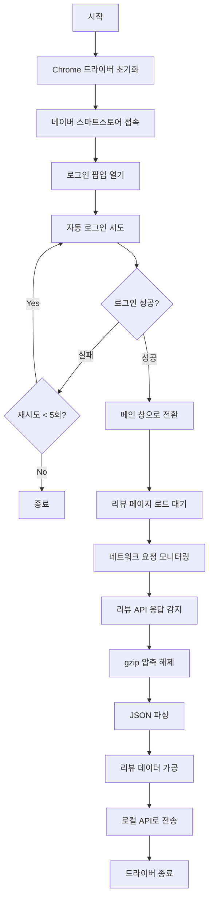

# Windsurf 프로젝트 분석 보고서

## 📋 프로젝트 개요

**프로젝트명**: Naver Review Crawling  
**목적**: 네이버 스마트스토어 리뷰 자동 수집 시스템  
**개발 언어**: Python  
**주요 기술**: Selenium, Selenium-wire, Web Scraping

---

## 🏗️ 프로젝트 구조

```
naver-review-crawling/
├── .git/                    # Git 버전 관리
├── .idea/                   # IDE 설정 파일
├── README.md               # 프로젝트 설명 (기본 템플릿)
├── chromedriver            # Chrome 웹드라이버 (17.99 MB)
└── naver.py                # 메인 크롤링 스크립트 (5.36 KB)
```

---

## 🔍 주요 파일 분석

### 1. `naver.py` - 메인 크롤링 스크립트

#### **핵심 기능**

1. **네이버 스마트스토어 자동 로그인**
   - 캡차 우회를 위한 타이핑 딜레이 구현
   - 로그인 재시도 로직 (최대 5회)
   - 캡차 감지 및 대기 처리

2. **리뷰 데이터 수집**
   - Selenium-wire를 사용한 네트워크 요청 가로채기
   - API 응답 데이터 파싱 (gzip 압축 해제)
   - 리뷰 첨부 파일 URL 추출

3. **데이터 전송**
   - 로컬 API 서버로 리뷰 데이터 전송 (`http://localhost:3013/api/insert_review`)
   - JSON 형식으로 데이터 변환 및 전송

#### **사용된 주요 라이브러리**

```python
- selenium / selenium-wire  # 웹 자동화 및 네트워크 모니터링
- requests                  # HTTP 요청
- pyperclip                 # 클립보드 제어
- cryptography              # 암호화 (OpenSSL 바인딩)
- json, gzip                # 데이터 처리
```

#### **코드 구조**

```python
1. 유틸리티 함수
   - camel_to_snake(): 카멜케이스 → 스네이크케이스 변환
   - DateTimeEncoder: datetime 객체 JSON 직렬화

2. login() 함수
   - 자동 로그인 처리
   - 타이핑 딜레이로 봇 탐지 우회
   - 하드코딩된 계정 정보 (보안 취약점)

3. 메인 실행 로직
   - Chrome 드라이버 초기화
   - 스마트스토어 로그인 페이지 접속
   - 팝업 창 전환 및 로그인
   - 리뷰 API 응답 가로채기
   - 데이터 파싱 및 전송
```

---

## 🔐 보안 이슈

### ⚠️ 심각한 보안 취약점 발견

1. **하드코딩된 계정 정보**
   ```python
   # Line 34-54: 아이디 'innerviewit'
   # Line 70-86: 비밀번호 '$inner23$'
   ```
   - **위험도**: 🔴 높음
   - **권장 사항**: 환경 변수 또는 별도 설정 파일 사용

2. **API 엔드포인트 노출**
   ```python
   # Line 163: http://localhost:3013/api/insert_review
   ```
   - **권장 사항**: 설정 파일로 분리

---

## 🎯 주요 기능 흐름



---

## 📊 데이터 처리 과정

### 수집되는 리뷰 데이터 필드

```javascript
{
  "reviewAttaches": [...],      // 첨부 파일 배열
  "files": "url1,url2,...",     // 첨부 파일 URL (쉼표 구분)
  "maskedMemberId": "...",      // 작성자 ID (마스킹)
  "maskedWriterId": "...",      // 작성자 ID (원본)
  // ... 기타 리뷰 정보
}
```

### 데이터 변환 과정

1. **API 응답 가로채기**
   ```
   네이버 API → Selenium-wire → gzip 압축 데이터
   ```

2. **압축 해제 및 파싱**
   ```python
   gzip.decompress() → JSON 파싱 → Python dict
   ```

3. **데이터 가공**
   - 첨부 파일 URL 추출 및 문자열 결합
   - 필드명 정규화

4. **전송**
   ```
   Python dict → JSON → HTTP POST → 로컬 API
   ```

---

## 🛠️ 기술 스택

| 카테고리 | 기술 |
|---------|------|
| **언어** | Python 3.x |
| **웹 자동화** | Selenium, Selenium-wire |
| **HTTP 클라이언트** | requests |
| **데이터 처리** | json, gzip |
| **암호화** | cryptography |
| **웹 드라이버** | ChromeDriver |
| **클립보드** | pyperclip |

---

## 📝 개선 제안

### 1. 보안 강화
- [ ] 환경 변수로 계정 정보 이동 (`.env` 파일)
- [ ] `.gitignore`에 민감 정보 추가
- [ ] API 엔드포인트 설정 파일 분리

### 2. 코드 품질
- [ ] 함수 모듈화 (로그인, 데이터 수집, 전송 분리)
- [ ] 에러 핸들링 추가 (try-except)
- [ ] 로깅 시스템 구축
- [ ] 타입 힌팅 추가

### 3. 의존성 관리
- [ ] `requirements.txt` 파일 생성
- [ ] 버전 명시

### 4. 문서화
- [ ] README.md 업데이트 (현재 기본 템플릿 상태)
- [ ] 설치 및 실행 가이드 작성
- [ ] API 문서화

### 5. 기능 개선
- [ ] 설정 파일 지원 (config.yaml)
- [ ] 크롤링 스케줄링 기능
- [ ] 데이터베이스 직접 저장 옵션
- [ ] 멀티 계정 지원
- [ ] 진행 상황 표시

---

## 🚀 실행 방법 (추정)

```bash
# 1. 의존성 설치 (requirements.txt 필요)
pip install selenium selenium-wire requests pyperclip cryptography

# 2. ChromeDriver 경로 확인
# 현재 프로젝트 루트에 chromedriver 존재

# 3. 로컬 API 서버 실행 (별도 프로젝트)
# http://localhost:3013/api/insert_review 엔드포인트 필요

# 4. 크롤링 스크립트 실행
python naver.py
```

---

## ⚙️ 시스템 요구사항

- **Python**: 3.7 이상 (추정)
- **Chrome 브라우저**: 설치 필요
- **ChromeDriver**: 프로젝트에 포함됨 (17.99 MB)
- **로컬 API 서버**: `localhost:3013` 실행 중이어야 함
- **네트워크**: 네이버 스마트스토어 접근 가능

---

## 🔄 워크플로우

1. **초기 설정**
   - Chrome 드라이버 초기화
   - Selenium-wire 설정

2. **인증**
   - 네이버 스마트스토어 로그인
   - 캡차 처리

3. **데이터 수집**
   - 리뷰 페이지 로드
   - 네트워크 요청 모니터링
   - API 응답 파싱

4. **데이터 처리**
   - 리뷰 데이터 가공
   - 로컬 API로 전송

5. **종료**
   - 드라이버 종료

---

## 📌 주의사항

1. **법적 고려사항**
   - 웹 크롤링 시 네이버 이용약관 준수 필요
   - robots.txt 확인 권장

2. **기술적 제약**
   - 캡차 발생 시 수동 개입 필요 (20초 대기)
   - 로그인 실패 시 최대 5회 재시도 후 종료

3. **의존성**
   - 로컬 API 서버가 실행 중이어야 함
   - ChromeDriver 버전과 Chrome 브라우저 버전 호환성 필요

---

## 📈 프로젝트 상태

- **개발 단계**: 프로토타입/초기 버전
- **문서화 수준**: 낮음 (README는 기본 템플릿)
- **코드 품질**: 개선 필요 (보안, 모듈화)
- **유지보수성**: 중간 (단일 파일 구조)

---

## 🎓 학습 포인트

이 프로젝트에서 배울 수 있는 기술:

1. **Selenium 웹 자동화**
   - 동적 웹 페이지 제어
   - 팝업 창 처리
   - 대기 조건 설정

2. **Selenium-wire**
   - 네트워크 요청 가로채기
   - API 응답 모니터링

3. **데이터 처리**
   - gzip 압축 해제
   - JSON 파싱 및 변환

4. **봇 탐지 우회**
   - 타이핑 딜레이
   - 인간 행동 모방

---

## 📅 작성 정보

- **분석 일자**: 2025-09-30
- **분석 도구**: Windsurf AI
- **프로젝트 경로**: `/Users/sinseonghyeon/Documents/GitHub/02-web-development/innerview-project/naver-review-crawling`

---

## 🔗 관련 리소스

- [Selenium 공식 문서](https://www.selenium.dev/documentation/)
- [Selenium-wire GitHub](https://github.com/wkeeling/selenium-wire)
- [네이버 스마트스토어](https://sell.smartstore.naver.com/)

---

*이 문서는 Windsurf AI에 의해 자동 생성되었습니다.*
