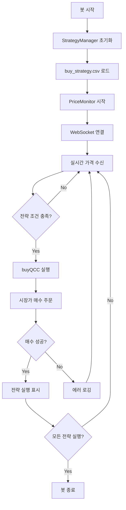

# Windsurf - Test LBank API 프로젝트 분석

## 📋 프로젝트 개요

**프로젝트명**: test_lbank-api  
**프로젝트 유형**: 암호화폐 자동 거래 봇 (LBank 거래소)  
**주요 기능**: QCC/USDT 페어 실시간 가격 모니터링 및 자동 매수  
**개발 언어**: Node.js (JavaScript)  
**분석 날짜**: 2025-10-13

---

## 🎯 핵심 기능

### 1. **실시간 가격 모니터링**
- LBank 거래소의 WebSocket API를 통해 QCC/USDT 페어의 실시간 가격 추적
- 가격 변동률 계산 및 로깅
- 자동 재연결 기능 (최대 5회 시도)

### 2. **전략 기반 자동 매수**
- CSV 파일 기반 매수 전략 관리
- 설정된 가격 조건 도달 시 자동 매수 실행
- 중복 매수 방지 (전략별 1회 실행)
- 모든 전략 실행 완료 시 자동 종료

### 3. **REST API 서버**
- Express 기반 RESTful API 제공
- LBank 거래소 데이터 조회 엔드포인트
- 수동 주문 생성/취소 기능

---

## 📁 프로젝트 구조

```
test_lbank-api/
├── config/                          # 설정 파일
│   ├── buy_strategy.csv            # 매수 전략 설정
│   └── sell_strategy.csv           # 매도 전략 설정 (미구현)
├── logs/                           # 로그 파일 디렉토리
├── src/
│   ├── app.js                      # Express API 서버 메인
│   ├── bot/
│   │   └── tradingBot.js          # 자동 거래 봇 메인 로직
│   ├── routes/
│   │   └── lbank.js               # LBank API 라우트
│   ├── services/
│   │   ├── lbank.js               # LBank API 클라이언트
│   │   ├── priceMonitor.js        # 가격 모니터링 서비스
│   │   ├── strategyManager.js     # 전략 관리 서비스
│   │   ├── buyQcc.js              # QCC 매수 실행 서비스
│   │   └── encryption.js          # 암호화 서비스 (미사용)
│   ├── config/
│   │   └── database.js            # 데이터베이스 설정 (미사용)
│   └── models/
│       └── User.js                # 사용자 모델 (미사용)
├── .env                           # 환경 변수 (API 키 등)
├── .gitignore                     # Git 제외 파일
├── ecosystem.config.js            # PM2 프로세스 관리 설정
├── package.json                   # 프로젝트 의존성
├── start.sh                       # 봇 시작 스크립트
└── README.md                      # 프로젝트 설명
```

---

## 🔧 기술 스택

### **런타임 & 프레임워크**
- **Node.js**: JavaScript 런타임
- **Express.js**: REST API 서버 프레임워크

### **주요 라이브러리**
| 라이브러리 | 버전 | 용도 |
|-----------|------|------|
| `axios` | ^1.9.0 | HTTP 클라이언트 (REST API 호출) |
| `ws` | ^8.14.2 | WebSocket 클라이언트 (실시간 데이터) |
| `csv-parse` | ^5.6.0 | CSV 파일 파싱 (전략 로드) |
| `dotenv` | ^16.5.0 | 환경 변수 관리 |
| `crypto` | ^1.0.1 | API 서명 생성 |
| `pm2` | ^5.3.1 | 프로세스 관리 (데몬화) |
| `nodemon` | ^3.0.2 | 개발 모드 자동 재시작 |

---

## 🚀 주요 모듈 상세 분석

### 1. **tradingBot.js** (자동 거래 봇 메인)

**역할**: 전체 거래 봇의 진입점 및 제어 로직

**주요 기능**:
- `PriceMonitor`를 통한 실시간 가격 모니터링
- `StrategyManager`를 통한 매수 전략 관리
- 가격 조건 충족 시 `buyQCC` 호출
- 중복 매수 방지 플래그 (`isBuying`)
- 모든 전략 실행 완료 시 자동 종료

**핵심 로직**:
```javascript
monitor.onPriceChange((price) => {
  // 1. 모든 전략 실행 확인
  if (strategyManager.isAllStrategiesExecuted()) {
    process.exit(0);
  }
  
  // 2. 매수 조건 확인 및 실행
  if (!isBuying) {
    const quantity = strategyManager.getBuyQuantity(price);
    if (quantity > 0) {
      isBuying = true;
      buyQCC(quantity).then(...);
    }
  }
});
```

---

### 2. **priceMonitor.js** (가격 모니터링)

**역할**: WebSocket을 통한 실시간 가격 추적

**주요 기능**:
- LBank WebSocket 연결 관리
- 티커 데이터 구독 (`tick` 이벤트)
- Ping/Pong 자동 응답
- 가격 변동률 계산
- 콜백 기반 가격 변경 알림
- 자동 재연결 (최대 5회, 지수 백오프)

**WebSocket 메시지 구조**:
```javascript
// 구독 요청
{
  action: 'subscribe',
  subscribe: 'tick',
  pair: 'qcc_usdt'
}

// 가격 데이터
{
  type: 'tick',
  pair: 'qcc_usdt',
  tick: {
    latest: '0.035',    // 현재가
    change: '-2.5',     // 24시간 변동률
    vol: '1000000'      // 거래량
  }
}
```

---

### 3. **strategyManager.js** (전략 관리)

**역할**: CSV 기반 매수 전략 로드 및 실행 관리

**주요 기능**:
- `buy_strategy.csv` 파일 파싱
- 가격 조건에 따른 매수 수량 결정
- 실행된 전략 추적 (`Set` 자료구조)
- 전략 순차 실행 (CSV 순서대로)

**전략 파일 형식** (`buy_strategy.csv`):
```csv
가격,수량
0.03,1
0.04,2
0.03,3
```

**전략 실행 로직**:
- 현재가 ≤ 전략 가격 → 매수 실행
- 한 번 실행된 전략은 재실행 안 됨
- 순차적으로 다음 전략 확인

---

### 4. **lbank.js** (LBank API 클라이언트)

**역할**: LBank 거래소 REST API 래퍼

**주요 기능**:
1. **공개 API**
   - `getTicker()`: 시장 데이터 조회
   - `getDepth()`: 주문서 조회
   - `getTrades()`: 거래 내역 조회

2. **인증 API**
   - `createOrder()`: 지정가 주문
   - `createMarketOrder()`: 시장가 주문
   - `cancelOrder()`: 주문 취소
   - `getUserInfo()`: 계정 정보

**API 서명 생성 프로세스**:
```javascript
1. 파라미터를 알파벳 순으로 정렬
2. key=value 형식으로 연결 (&로 구분)
3. MD5 해시 생성 (대문자 변환)
4. HmacSHA256으로 최종 서명 생성
```

**시장가 주문 파라미터**:
```javascript
{
  api_key: 'YOUR_API_KEY',
  symbol: 'qcc_usdt',
  type: 'buy_market',
  price: '1',              // 고정값
  amount: '100',           // 매수 수량
  signature_method: 'HmacSHA256',
  timestamp: '1697123456789',
  echostr: 'ABCDEFGHIJ1697123456789KLMNOPQRST',
  sign: 'generated_signature'
}
```

---

### 5. **buyQcc.js** (매수 실행)

**역할**: QCC 시장가 매수 실행

**주요 기능**:
- 환경 변수에서 API 키 로드
- `LBankClient.createMarketOrder()` 호출
- 매수 결과 로깅
- 성공/실패 여부 반환

---

### 6. **app.js** (REST API 서버)

**역할**: Express 기반 API 서버

**제공 엔드포인트**:
| 메서드 | 경로 | 설명 |
|--------|------|------|
| GET | `/` | 서버 상태 확인 |
| GET | `/api/lbank/ticker/:symbol` | 시장 데이터 조회 |
| GET | `/api/lbank/depth/:symbol` | 주문서 조회 |
| GET | `/api/lbank/trades/:symbol` | 거래 내역 조회 |
| GET | `/api/lbank/user-info` | 계정 정보 조회 |
| POST | `/api/lbank/order` | 주문 생성 |
| POST | `/api/lbank/order/cancel` | 주문 취소 |

---

## ⚙️ 설정 및 실행

### **환경 변수** (`.env`)
```env
LBANK_API_KEY=your_api_key_here
LBANK_SECRET_KEY=your_secret_key_here
PORT=3000
```

### **실행 방법**

#### 1. **개발 모드** (nodemon)
```bash
npm run dev
```

#### 2. **프로덕션 모드** (직접 실행)
```bash
npm start
```

#### 3. **PM2로 백그라운드 실행**
```bash
# 시작
npm run pm2:start
# 또는
./start.sh

# 중지
npm run pm2:stop

# 재시작
npm run pm2:restart

# 삭제
npm run pm2:delete

# 로그 확인
npm run pm2:logs
```

### **PM2 설정** (`ecosystem.config.js`)
```javascript
{
  name: 'qcc-trading-bot',
  script: 'src/bot/tradingBot.js',
  watch: false,
  autorestart: false,        // 자동 재시작 비활성화
  max_memory_restart: '1G',
  log_date_format: 'YYYY-MM-DD HH:mm:ss',
  error_file: 'logs/error.log',
  out_file: 'logs/out.log'
}
```

---

## 🔄 동작 흐름

### **자동 거래 봇 실행 흐름**



### **API 서명 생성 흐름**

```
1. 파라미터 준비
   ↓
2. 알파벳 순 정렬
   ↓
3. key=value&key=value 문자열 생성
   ↓
4. MD5 해시 (대문자)
   ↓
5. HmacSHA256 서명
   ↓
6. 최종 서명 반환
```

---

## 📊 매수 전략 예시

### **현재 설정** (`buy_strategy.csv`)

| 순서 | 가격 (USDT) | 수량 (QCC) | 설명 |
|------|-------------|-----------|------|
| 1 | 0.03 | 1 | 0.03 이하일 때 1 QCC 매수 |
| 2 | 0.04 | 2 | 0.04 이하일 때 2 QCC 매수 |
| 3 | 0.03 | 3 | 0.03 이하일 때 3 QCC 매수 |

### **실행 시나리오**

**시나리오 1**: 가격이 0.05 → 0.039 → 0.029로 하락
1. 0.039 도달 → 전략 2 실행 (2 QCC 매수)
2. 0.029 도달 → 전략 1 실행 (1 QCC 매수)
3. 0.029 유지 → 전략 3 실행 (3 QCC 매수)
4. 모든 전략 완료 → 봇 종료

**시나리오 2**: 가격이 0.05 → 0.025로 급락
1. 0.025 도달 → 전략 1 실행 (1 QCC 매수)
2. 가격 유지 → 전략 2 실행 (2 QCC 매수)
3. 가격 유지 → 전략 3 실행 (3 QCC 매수)
4. 모든 전략 완료 → 봇 종료

---

## 🔒 보안 고려사항

### **현재 구현된 보안**
1. ✅ `.env` 파일로 API 키 관리
2. ✅ `.gitignore`에 `.env` 포함
3. ✅ HmacSHA256 API 서명

### **개선 권장사항**
1. ⚠️ API 키 암호화 저장 (현재 평문)
2. ⚠️ HTTPS 통신 강제
3. ⚠️ Rate Limiting 구현
4. ⚠️ 매수 금액 상한선 설정
5. ⚠️ 에러 로그에 민감 정보 제외

---

## 🐛 알려진 이슈 및 제한사항

### **현재 이슈**
1. **매도 기능 미구현**
   - `sell_strategy.csv` 파일은 존재하나 로직 없음
   - 매수만 가능, 수동 매도 필요

2. **데이터베이스 미사용**
   - `database.js`, `User.js` 파일 존재하나 미연결
   - 거래 내역 저장 안 됨

3. **에러 처리 부족**
   - 네트워크 오류 시 재시도 로직 부족
   - API 오류 시 봇 중단 가능성

4. **단일 페어만 지원**
   - QCC/USDT 페어만 하드코딩
   - 다른 코인 거래 불가

### **제한사항**
- 자동 재시작 비활성화 (`autorestart: false`)
- 최대 5회 WebSocket 재연결 시도
- 동시 매수 방지 (순차 처리)

---

## 🚀 개선 제안

### **단기 개선 (High Priority)**
1. **매도 전략 구현**
   - `sell_strategy.csv` 파싱
   - 목표가 도달 시 자동 매도
   - 손절/익절 로직

2. **거래 내역 저장**
   - SQLite 또는 MongoDB 연동
   - 매수/매도 기록 저장
   - 수익률 계산

3. **에러 핸들링 강화**
   - API 오류 재시도 로직
   - 네트워크 단절 대응
   - 잔액 부족 처리

### **중기 개선 (Medium Priority)**
4. **다중 페어 지원**
   - 설정 파일로 페어 관리
   - 페어별 독립 전략

5. **웹 대시보드**
   - 실시간 가격 차트
   - 거래 내역 조회
   - 전략 수정 UI

6. **알림 기능**
   - 텔레그램/이메일 알림
   - 매수/매도 알림
   - 에러 알림

### **장기 개선 (Low Priority)**
7. **고급 전략**
   - 기술적 지표 (RSI, MACD)
   - 변동성 기반 매수
   - 분할 매수/매도

8. **백테스팅**
   - 과거 데이터로 전략 검증
   - 수익률 시뮬레이션

9. **멀티 거래소 지원**
   - Binance, Upbit 등 추가
   - 거래소 간 차익거래

---

## 📈 성능 및 리소스

### **예상 리소스 사용량**
- **메모리**: ~50-100MB
- **CPU**: 거의 사용 안 함 (이벤트 기반)
- **네트워크**: WebSocket 연결 1개 (지속)

### **확장성**
- 단일 프로세스로 충분
- 다중 페어 시 프로세스 분리 권장
- PM2 클러스터 모드 불필요

---

## 🧪 테스트 방법

### **가격 모니터링 테스트**
```bash
node src/services/priceMonitor.js
```
- 30초간 QCC 가격 모니터링
- WebSocket 연결 확인

### **전략 로드 테스트**
```bash
node -e "const SM = require('./src/services/strategyManager'); const sm = new SM();"
```

### **API 연결 테스트**
```bash
curl http://localhost:3000/api/lbank/ticker/qcc_usdt
```

---

## 📝 코드 품질 평가

### **장점**
- ✅ 모듈화가 잘 되어 있음
- ✅ 콜백 기반 이벤트 처리
- ✅ 환경 변수 분리
- ✅ PM2 프로세스 관리

### **개선 필요**
- ⚠️ 주석 부족
- ⚠️ 단위 테스트 없음
- ⚠️ 타입스크립트 미사용
- ⚠️ 에러 처리 일관성 부족

---

## 🔗 관련 문서

### **LBank API 문서**
- REST API: https://www.lbank.com/en-US/docs/index.html
- WebSocket API: https://www.lbank.com/en-US/docs/websocket.html

### **사용된 기술 문서**
- Express.js: https://expressjs.com/
- WebSocket (ws): https://github.com/websockets/ws
- PM2: https://pm2.keymetrics.io/

---

## 📞 문의 및 지원

프로젝트 관련 문의사항이나 버그 리포트는 GitHub Issues를 통해 제출해주세요.

---

## 📄 라이선스

이 프로젝트의 라이선스 정보는 별도로 명시되지 않았습니다.

---

## 🎓 학습 포인트

이 프로젝트를 통해 배울 수 있는 것들:

1. **WebSocket 실시간 통신**
   - 연결 관리, 재연결 로직
   - Ping/Pong 처리

2. **암호화폐 거래소 API 연동**
   - REST API 인증
   - API 서명 생성

3. **이벤트 기반 아키텍처**
   - 콜백 패턴
   - 비동기 처리

4. **프로세스 관리**
   - PM2 데몬화
   - 로그 관리

5. **전략 패턴**
   - CSV 기반 설정
   - 조건부 실행

---

**분석 완료일**: 2025-10-13  
**분석자**: Windsurf AI Assistant  
**버전**: 1.0.0
