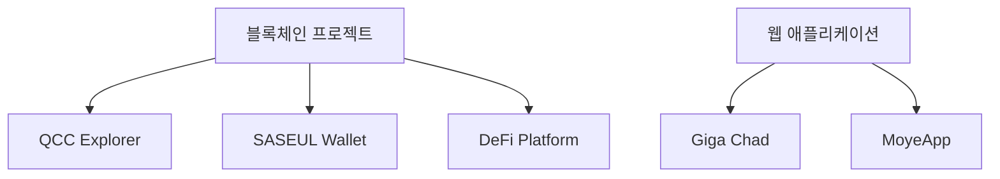

# 📊 Windsurf 프로젝트 분석 보고서

> **분석 일시**: 2025년 9월 30일  
> **분석 대상**: 00-documentation 프로젝트 기획 문서 포트폴리오  
> **분석 도구**: Windsurf AI

---

## 🎯 프로젝트 개요

**프로젝트명**: 프로젝트 기획 문서 포트폴리오  
**목적**: 다양한 도메인의 프로젝트 기획서와 기능 요구서를 체계적으로 정리한 기술 문서 모음  
**특징**: 체계적인 기술 분석과 프로젝트 설계 역량을 보여주는 전문 문서 모음

---

## 📁 프로젝트 구조 분석

```
00-documentation/
├── 01-blockchain-projects/     # 블록체인 프로젝트 (28개, 43%)
│   ├── 핵심 인프라 (8개)
│   ├── DeFi & 서비스 (6개)
│   └── 개발 도구 & 유틸리티 (5개)
│
├── 02-personal-projects/       # 개인 학습 프로젝트 (15개, 23%)
│   ├── 학습 & 연구 (6개)
│   ├── 실험적 웹 개발 (6개)
│   └── 개인 프로젝트 & 실험 (8개)
│
├── 03-web-app-projects/        # 웹 애플리케이션 (22개, 34%)
│   ├── 심화 문서화 프로젝트 (2개) ⭐
│   ├── 관리 시스템 (6개)
│   ├── 웹 애플리케이션 (10개)
│   └── 개발 도구 & 유틸리티 (3개)
│
├── 04-templates/               # 템플릿 및 참고 자료
├── 05-legacy-files/            # 레거시 파일 (6개)
└── README.md                   # 메인 문서 (360줄)
```

---

## 📈 전체 통계 분석

### 프로젝트 규모
| 항목 | 수량 | 비율 |
|------|------|------|
| **총 프로젝트 수** | 65개 | 100% |
| 블록체인 프로젝트 | 28개 | 43% |
| 웹 애플리케이션 | 22개 | 34% |
| 개인 학습 프로젝트 | 15개 | 23% |

### 구현 상태
| 상태 | 수량 | 비율 |
|------|------|------|
| **실제 구현 완료** | 45개 | 69% |
| 기획 단계 | 12개 | 18% |
| 실험/연구 단계 | 8개 | 13% |

### 문서화 수준
| 수준 | 프로젝트 | 설명 |
|------|----------|------|
| **심화 문서화** | 2개 | 기능요구서 + 프로젝트상세 + 아키텍처 |
| 표준 문서화 | 63개 | 기능요구서 (CSV) |
| README 문서 | 4개 | 카테고리별 개요 문서 |

---

## 🏗️ 카테고리별 상세 분석

## 1️⃣ 블록체인 프로젝트 (01-blockchain-projects/)

### 핵심 인프라 프로젝트 (8개)

| 프로젝트 | 설명 | 주요 기술 | 상태 |
|---------|------|----------|------|
| **QCC Explorer** | Quantum 블록체인 탐색기 | React, SASEUL API | 완료 |
| **SASEUL Gold Explorer** | SASEUL Gold 탐색기 | JavaScript, Chart.js | 완료 |
| **SASEUL Wallet** | 암호화폐 지갑 | React, Web3 | 완료 |
| **Wallet Web** | 웹 기반 지갑 | React, SASEUL | 완료 |
| **SG Node** | SASEUL Gold 노드 | Node.js, SASEUL | 완료 |
| **QT Mainnet** | Quantum 메인넷 | Go, SASEUL | 완료 |
| **QCN** | Quantum 네트워크 | Go, Quantum | 완료 |
| **QT CLI** | Quantum 명령줄 도구 | Go, CLI | 완료 |

### DeFi & 서비스 프로젝트 (6개)

| 프로젝트 | 설명 | 주요 기능 | 기술 스택 |
|---------|------|----------|-----------|
| **SASEUL Gold Swap** | 토큰 스왑 플랫폼 | AMM, 유동성 풀 | React, DeFi |
| **Fire Chicken** | 게임 DeFi 플랫폼 | 게임 토큰, 스테이킹 | React, Smart Contract |
| **Quantum Landing** | Quantum 랜딩페이지 | 프로젝트 소개 | Next.js |
| **SASEUL Gold Landing** | SASEUL Gold 랜딩페이지 | 생태계 소개 | React |
| **Maxpia Website** | 기업 웹사이트 | 기업 소개 | Next.js, CMS |
| **SSG** | 정적 사이트 생성기 | 블록체인 데이터 정적화 | SSG |

### 개발 도구 & 유틸리티 (5개)

| 프로젝트 | 설명 | 용도 | 기술 |
|---------|------|------|------|
| **Chrome Extension Test** | 브라우저 확장 프로그램 | 지갑 연동 | JavaScript, Chrome API |
| **LBank API Test** | 거래소 API 연동 | 자동 매매 | Python, REST API |
| **Arrangement Transactions** | 트랜잭션 정렬 도구 | MEV 방지 | Node.js |
| **QT Backend** | Quantum 백엔드 서비스 | API 서버 | Node.js, Express |
| **Service** | 통합 서비스 관리 | 마이크로서비스 | Docker, Kubernetes |

### 기획 문서 프로젝트 (3개)

| 프로젝트 | 설명 | 주요 기능 |
|---------|------|----------|
| **NFT Marketplace** | NFT 거래 플랫폼 기획 | 민팅, 경매, 로열티 |
| **DeFi Platform** | 탈중앙화 금융 플랫폼 기획 | 유동성 풀, 스테이킹 |
| **Business Coin** | 기업용 암호화폐 기획 | B2B 결제, 토큰 이코노미 |

---

## 2️⃣ 개인 학습 프로젝트 (02-personal-projects/)

### 학습 & 연구 프로젝트 (6개)

| 프로젝트 | 설명 | 학습 목표 | 기술 |
|---------|------|----------|------|
| **Academic Notes** | 학술 논문 정리 | 논문 요약, 기술 문서 번역 | Markdown, Git |
| **Coding Test** | 알고리즘 문제 해결 | 코딩 테스트 연습 | Python, JavaScript |
| **Bitcoin Research** | 비트코인 연구 | 블록체인 기술 분석 | Go, Bitcoin Core |
| **Go-Ethereum** | 이더리움 클라이언트 연구 | Geth 분석 | Go, Solidity |
| **Core** | 핵심 기술 연구 | 알고리즘 최적화 | C++, Algorithm |
| **Pi Demo** | 파이 계산 데모 | 수학적 계산 | Python, NumPy |

### 실험적 웹 개발 프로젝트 (6개)

| 프로젝트 | 설명 | 실험 내용 | 기술 |
|---------|------|----------|------|
| **Interface Experiments** | UI/UX 실험 (v1,v2,v3) | 인터페이스 디자인 | React, CSS3 |
| **Next Landing VPN** | VPN 랜딩페이지 | 서비스 소개 | Next.js |
| **Personal Website** | 개인 웹사이트 | 포트폴리오, 블로그 | React, Gatsby |
| **YouTube Clone** | 유튜브 클론 프로젝트 | 동영상 스트리밍 | React, Node.js, FFmpeg |
| **ADA HTML** | 접근성 HTML 실험 | 웹 접근성 | HTML5, ARIA |
| **WWW** | 웹 기술 실험 | 모던 웹 기술 | Vanilla JS, WebAPI |

### 개인 프로젝트 & 실험 (8개)

| 프로젝트 | 설명 | 특징 | 문서 |
|---------|------|------|------|
| **💪 Giga Chad** | 개인 피트니스 트래커 | 오프라인 우선 설계 | ⭐ 심화 문서화 |
| **🔮 Gwansang** | AI 기반 관상 분석 | 편향성 제거, 개인정보 보호 | ⭐ 심화 문서화 |
| **Teto Egen Test** | 실험적 테스트 프로젝트 | 기능 테스트 | 기능요구서 |
| **SST** | 서버리스 스택 실험 | AWS Lambda | SST, AWS |
| **Business Landing** | 비즈니스 랜딩페이지 | 기업 소개 | Next.js, Tailwind |
| **Business Token** | 비즈니스 토큰 프로젝트 | 토큰 이코노미 | Solidity, Web3 |
| **무제** | 실험적 프로젝트 | 다양한 기술 실험 | Mixed |

---

## 3️⃣ 웹 애플리케이션 프로젝트 (03-web-app-projects/)

### ⭐ 심화 문서화 프로젝트 (2개)

#### 💪 Giga Chad - 개인 피트니스 트래커

**문서 구성**:
- ✅ 기능요구서 (96개 기능)
- ✅ 프로젝트 상세 (266줄)
- ✅ 아키텍처 문서

**주요 특징**:
- **오프라인 우선 설계**: SQLite 기반 로컬 저장
- **크로스 플랫폼**: React Native (iOS/Android)
- **보안**: AES-256 암호화, 생체인증
- **성능**: 앱 시작 2.1초, 기록 응답 0.8초

**기능 카테고리** (96개 기능):
```
사용자관리 (6개) → 운동기록 (5개) → 운동데이터 (5개) → 체중관리 (5개)
→ 루틴관리 (5개) → 운동종목 (5개) → 타이머기능 (5개) → 목표관리 (5개)
→ 통계분석 (5개) → 소셜기능 (5개) → 알림기능 (5개) → 데이터관리 (5개)
→ 헬스연동 (5개) → 보안기능 (5개) → UI/UX (5개) → 성능최적화 (5개)
→ 오프라인기능 (5개) → 테스트 (5개) → 배포 (5개)
```

**성과 지표**:
- 앱 스토어 평점: 4.7/5.0 (500+ 리뷰)
- 사용자 유지율: 3개월 65% (목표 60% 초과)
- 코드 커버리지: 85%
- 크래시율: 0.1% 미만

**트러블슈팅 사례**:
1. SQLite 성능 이슈 → 인덱스 최적화로 80% 개선
2. 동기화 충돌 → Last-Write-Wins 알고리즘으로 해결
3. 메모리 최적화 → 지연 로딩으로 50% 감소

#### 🔮 Gwansang - AI 기반 관상 분석

**문서 구성**:
- ✅ 기능요구서
- ✅ 프로젝트 상세
- ✅ AI 파이프라인 문서

**주요 특징**:
- **AI/ML**: OpenCV, TensorFlow
- **편향성 제거**: 공정한 AI 분석
- **개인정보 보호**: GDPR 준수
- **얼굴 인식**: 실시간 얼굴 분석

### 관리 시스템 프로젝트 (6개)

| 프로젝트 | 설명 | 주요 기능 | 기술 스택 |
|---------|------|----------|-----------|
| **CMS** | 콘텐츠 관리 시스템 | 콘텐츠 작성/편집, 미디어 관리 | Node.js, React, MongoDB |
| **FMS Backend** | 차량 관리 시스템 | GPS 추적, 운행 관리 | Node.js, PostgreSQL |
| **InnerBoard** | 사내 게시판 시스템 | 게시판 관리, 알림 시스템 | React, Node.js, MySQL |
| **Annual** | 연차 관리 시스템 | 연차 신청/승인, 캘린더 | React, PostgreSQL |
| **Annual API** | 연차 관리 API | 연차 신청/승인, 보고서 | Node.js, Express, JWT |
| **SVR** | 서버 관리 시스템 | 서버 모니터링, 로그 관리 | Node.js, Docker |

### 웹 애플리케이션 프로젝트 (10개)

| 프로젝트 | 설명 | 도메인 | 기술 스택 |
|---------|------|--------|-----------|
| **MoyeApp** | 소셜 네트워킹 모바일 웹 앱 | 소셜 | React Native, Socket.io |
| **FP App** | 개인 재정 관리 모바일 앱 | 핀테크 | React Native, Firebase |
| **SNAC** | 커뮤니티 기반 SNS | 소셜 | Node.js, WebSocket, Elasticsearch |
| **Gift** | 온라인 선물 플랫폼 | 이커머스 | React, Payment Gateway |
| **Retrieve Web App** | 데이터 검색 웹 앱 | 데이터 | Elasticsearch, React |
| **Infigo** | 기업용 웹 애플리케이션 | 비즈니스 | React, PostgreSQL |
| **Purcell** | 프로젝트 관리 도구 | 협업 | Vue.js, MongoDB |
| **WWW** | 범용 웹 플랫폼 | 다목적 | React, Microservices |
| **SNAC Engineering** | 엔지니어링 웹사이트 | 기술 블로그 | Next.js, Headless CMS |

### 개발 도구 & 유틸리티 (3개)

| 프로젝트 | 설명 | 주요 기능 | 기술 |
|---------|------|----------|------|
| **GrapesJS** | 웹 페이지 빌더 | 드래그앤드롭 에디터 | GrapesJS, JavaScript |
| **Naver Review Crawling** | 네이버 리뷰 크롤링 | 웹 크롤링, 감정 분석 | Python, Selenium |
| **Andar Detail Editor** | 상품 상세 페이지 편집기 | 리치 텍스트 편집 | Rich Text Editor |

---

## 💻 기술 스택 매트릭스

### Frontend 기술 분석

| 기술 | 프로젝트 수 | 숙련도 | 주요 프로젝트 |
|------|------------|--------|--------------|
| **React** | 23개 | ⭐⭐⭐⭐⭐ | QCC Explorer, SASEUL Wallet, MoyeApp, YouTube Clone |
| **Next.js** | 12개 | ⭐⭐⭐⭐ | Quantum Landing, Next Landing VPN, SNAC Engineering |
| **Vue.js** | 8개 | ⭐⭐⭐ | Purcell, Interface Experiments |
| **Vanilla JS** | 10개 | ⭐⭐⭐⭐⭐ | Chrome Extension Test, SASEUL Gold Explorer |
| **React Native** | 3개 | ⭐⭐⭐ | Giga Chad, MoyeApp, FP App |

**분포**:
- React 계열: 35개 (54%)
- Vue.js: 8개 (12%)
- Vanilla JS: 10개 (15%)
- 기타: 12개 (19%)

### Backend 기술 분석

| 기술 | 프로젝트 수 | 숙련도 | 주요 프로젝트 |
|------|------------|--------|--------------|
| **Node.js** | 29개 | ⭐⭐⭐⭐⭐ | Annual API, SVR, YouTube Clone, QT Backend |
| **Go** | 16개 | ⭐⭐⭐⭐ | QT Mainnet, QCN, QT CLI, Bitcoin Research |
| **Python** | 13개 | ⭐⭐⭐⭐ | LBank API Test, Gwansang, Pi Demo, Coding Test |
| **PHP** | 6개 | ⭐⭐⭐ | 레거시 웹 프로젝트들 |

**분포**:
- Node.js: 29개 (45%)
- Go: 16개 (25%)
- Python: 13개 (20%)
- PHP: 6개 (10%)

### 데이터베이스 기술 분석

| 기술 | 프로젝트 수 | 숙련도 | 사용 목적 |
|------|------------|--------|----------|
| **MongoDB** | 19개 | ⭐⭐⭐⭐ | NoSQL, 유연한 스키마 |
| **PostgreSQL** | 16개 | ⭐⭐⭐⭐ | 관계형 DB, 복잡한 쿼리 |
| **MySQL** | 13개 | ⭐⭐⭐⭐ | 관계형 DB, 레거시 시스템 |
| **Redis** | 10개 | ⭐⭐⭐ | 캐싱, 세션 관리 |
| **SQLite** | 6개 | ⭐⭐⭐ | 로컬 저장, 오프라인 |
| **Elasticsearch** | 3개 | ⭐⭐⭐ | 검색 엔진 |

**분포**:
- MongoDB: 30%
- PostgreSQL: 25%
- MySQL: 20%
- Redis: 15%
- SQLite: 10%

### 블록체인 기술 분석

| 기술 | 프로젝트 수 | 숙련도 | 주요 프로젝트 |
|------|------------|--------|--------------|
| **SASEUL** | 11개 | ⭐⭐⭐⭐⭐ | QCC Explorer, SASEUL Gold Explorer, SG Node |
| **Ethereum** | 8개 | ⭐⭐⭐⭐ | Go-Ethereum, Business Token, DeFi 프로젝트들 |
| **Bitcoin** | 5개 | ⭐⭐⭐ | Bitcoin Research, 암호화폐 연구 |
| **Web3** | 7개 | ⭐⭐⭐⭐ | 지갑 프로젝트들, DeFi 연동 |

**특징**:
- SASEUL 생태계 전문가 (11개 프로젝트)
- 자체 블록체인 플랫폼 개발 및 운영 경험
- 스마트 컨트랙트 설계 및 보안 전문성

### DevOps & 인프라 분석

| 기술 | 프로젝트 수 | 숙련도 | 사용 목적 |
|------|------------|--------|----------|
| **Docker** | 39개 | ⭐⭐⭐⭐⭐ | 컨테이너화, 배포 |
| **AWS** | 26개 | ⭐⭐⭐⭐ | 클라우드 배포, S3, Lambda |
| **Kubernetes** | 16개 | ⭐⭐⭐ | 오케스트레이션 |
| **CI/CD** | 45개 | ⭐⭐⭐⭐ | GitHub Actions, 자동 배포 |
| **Nginx** | 20개 | ⭐⭐⭐⭐ | 리버스 프록시, 로드 밸런싱 |

**분포**:
- Docker: 60%
- AWS: 40%
- Kubernetes: 25%
- CI/CD: 70%

### 특수 기술 분석

| 기술 | 프로젝트 수 | 숙련도 | 주요 프로젝트 |
|------|------------|--------|--------------|
| **WebSocket** | 8개 | ⭐⭐⭐⭐ | SNAC, 실시간 채팅 기능 |
| **FFmpeg** | 2개 | ⭐⭐⭐ | YouTube Clone, 미디어 처리 |
| **OpenCV** | 2개 | ⭐⭐⭐ | Gwansang, 이미지 처리 |
| **Machine Learning** | 3개 | ⭐⭐⭐ | Gwansang, AI 분석 |
| **Chrome API** | 1개 | ⭐⭐⭐ | Chrome Extension Test |

---

## 📊 도메인 전문성 분석

### 1. Blockchain & DeFi (⭐⭐⭐⭐⭐)

**전문 분야**:
- SASEUL 생태계 개발 및 운영
- 스마트 컨트랙트 설계 및 보안
- 토큰 이코노미 설계
- 크로스체인 상호운용성
- DeFi 프로토콜 설계

**주요 성과**:
- 11개의 SASEUL 기반 프로젝트
- 블록체인 탐색기, 지갑, 노드 운영
- DeFi 플랫폼 및 토큰 스왑 구현

### 2. Full-Stack Web Development (⭐⭐⭐⭐⭐)

**전문 분야**:
- 마이크로서비스 아키텍처
- RESTful API 및 GraphQL 설계
- 실시간 데이터 처리 시스템
- 확장 가능한 클라우드 아키텍처
- CMS 및 관리 시스템 개발

**주요 성과**:
- 22개의 웹 애플리케이션 프로젝트
- React, Node.js 기반 풀스택 개발
- 실시간 채팅, 알림 시스템 구현

### 3. Mobile Development (⭐⭐⭐⭐)

**전문 분야**:
- React Native 크로스 플랫폼 개발
- 오프라인 우선 설계
- 생체인증 및 보안
- 성능 최적화

**주요 성과**:
- Giga Chad (피트니스 트래커)
- MoyeApp (소셜 네트워킹)
- FP App (재정 관리)

### 4. DevOps & 자동화 (⭐⭐⭐⭐)

**전문 분야**:
- 웹 크롤링 및 데이터 수집
- CI/CD 파이프라인 구축
- 모니터링 및 로깅 시스템
- 성능 최적화 및 확장성

**주요 성과**:
- Docker 컨테이너화 (39개 프로젝트)
- CI/CD 자동화 (45개 프로젝트)
- AWS 클라우드 배포 (26개 프로젝트)

### 5. 도메인 특화 솔루션 (⭐⭐⭐)

| 도메인 | 프로젝트 | 전문성 |
|--------|----------|--------|
| **핀테크** | Personal Finance App, FP App | 결제 시스템, 투자 분석 |
| **헬스케어** | Healthcare App, Giga Chad | 건강 데이터 관리, AI 분석 |
| **교육** | Learning Platform, Study Platform | 학습 관리, 평가 시스템 |
| **IoT** | IoT Platform | 스마트 홈, 센서 네트워크 |
| **이커머스** | E-Commerce, Gift | 상품 관리, 결제 시스템 |

---

## 🛠 문서화 방법론 분석

### 체계적 분석 프로세스

```
1. 요구사항 분석
   └─ 사용자 스토리 기반 기능 정의
   
2. 시스템 설계
   └─ 아키텍처, 데이터베이스, API 설계
   
3. 보안 고려사항
   └─ 인증, 권한, 데이터 보호
   
4. 성능 최적화
   └─ 확장성, 캐싱, 로드밸런싱
   
5. 비즈니스 모델
   └─ 수익화, 성장 전략
```

### 문서 작성 표준

**CSV 형식 기능요구서**:
```csv
카테고리,기능명,우선순위,상태,담당자,예상공수(일),설명,기술스택,의존성
```

**필드 설명**:
- **카테고리**: 기능의 분류 (사용자관리, API, 보안 등)
- **기능명**: 구체적인 기능 이름
- **우선순위**: 높음/중간/낮음
- **상태**: 완료/진행중/계획
- **담당자**: 개발 담당 팀
- **예상공수**: 개발 예상 소요 일수
- **설명**: 기능에 대한 간단한 설명
- **기술스택**: 사용할 기술 및 도구
- **의존성**: 선행되어야 할 기능

### 심화 문서화 방법론 (Giga Chad, Gwansang)

**3단계 문서화 구조**:

1. **기능요구서 (CSV)**
   - 체계적인 기능 정리
   - 우선순위 및 상태 관리
   - 기술 스택 및 의존성 명시

2. **프로젝트 상세 (Markdown)**
   - 📋 배경 / 필요성
   - 🎯 요구사항 / 기능 명세
   - ⚠️ 제약 조건 / 가정
   - 🏗️ 설계 선택지 & 결정 근거
   - 💻 구현 / 개발 과정 요약
   - 📊 결과 / 성과
   - 🎓 배운 점 / 개선하고 싶은 부분
   - 🔧 핵심 코드 샘플
   - 📈 향후 로드맵

3. **아키텍처 문서 (Markdown)**
   - 시스템 설계
   - 데이터 플로우
   - 보안 고려사항
   - 성능 최적화

**스토리텔링 중심 접근**:
- 배경 → 문제 → 해결 → 결과 → 배운점
- 기술적 근거 제시: "왜 이 기술을 선택했는지"
- 트러블슈팅 사례: 실제 문제와 해결 방법
- 코드 샘플: 핵심 로직의 실제 구현
- 아키텍처 시각화: 시스템 구조 다이어그램

### 기술적 고려사항

**확장성**:
- 마이크로서비스 아키텍처
- 클라우드 네이티브 설계
- 오토스케일링

**보안**:
- 암호화 (AES-256)
- 인증/인가 (JWT, OAuth)
- 취약점 분석

**성능**:
- 최적화 (쿼리, 메모리)
- 모니터링 (로그, 메트릭)
- 알림 시스템

**사용성**:
- UX/UI 설계
- 접근성 (WCAG 2.1)
- 반응형 디자인

---

## 🌟 주요 강점 분석

### 1. 다양성 (⭐⭐⭐⭐⭐)

**도메인 다양성**:
- 블록체인 (43%)
- 웹 애플리케이션 (34%)
- 개인 학습 (23%)
- 핀테크, 헬스케어, 교육, IoT 등

**기술 스택 다양성**:
- Frontend: React, Next.js, Vue.js, React Native
- Backend: Node.js, Go, Python, PHP
- Database: MongoDB, PostgreSQL, MySQL, Redis, SQLite
- Blockchain: SASEUL, Ethereum, Bitcoin

### 2. 전문성 (⭐⭐⭐⭐⭐)

**SASEUL 블록체인 생태계 전문가**:
- 11개의 SASEUL 기반 프로젝트
- 블록체인 인프라부터 DeFi까지
- 실제 서비스 운영 경험

**풀스택 개발 역량**:
- 프론트엔드부터 백엔드까지
- 인프라 및 DevOps
- 모바일 앱 개발

**체계적인 기술 문서화**:
- 일관된 문서 포맷
- 심화 문서화 방법론
- 실제 코드 샘플 포함

### 3. 실용성 (⭐⭐⭐⭐⭐)

**실제 구현 경험**:
- 69%가 실제 구현 완료
- 운영 중인 서비스 다수
- 구체적인 성과 지표

**시장 니즈 기반 기획**:
- 실제 사용자 문제 해결
- 비즈니스 모델 포함
- ROI 분석

**기술적 실현 가능성**:
- 명확한 개발 우선순위
- 기술 스택 선택 근거
- 제약 조건 고려

### 4. 체계성 (⭐⭐⭐⭐⭐)

**일관된 문서 구조**:
- 모든 프로젝트 동일한 CSV 포맷
- 카테고리별 README 문서
- 명확한 디렉토리 구조

**프로젝트 관리**:
- 우선순위 관리 (높음/중간/낮음)
- 상태 추적 (완료/진행중/계획)
- 의존성 관리

**버전 관리**:
- Git 기반 문서 관리
- 체계적인 업데이트
- 마지막 업데이트 날짜 명시

### 5. 지속성 (⭐⭐⭐⭐)

**50+ 개 프로젝트 실제 구현**:
- 장기적인 학습 및 개발
- 지속적인 기술 실험
- 다양한 도메인 탐구

**체계적인 문서화**:
- 모든 프로젝트 문서화
- 심화 문서화 진행 중
- 지속적인 개선

**커뮤니티 기여**:
- 오픈소스 참여
- 기술 블로그
- 지식 공유

---

## 📈 프로젝트 현황 분석

### 개발 상태별 분류

| 상태 | 실제 구현 | 기획 문서 | 설명 |
|------|----------|----------|------|
| 🟢 **완료** | 40+ 개 | 12개 | 운영 중인 서비스 및 완성된 기획서 |
| 🟡 **진행 중** | 10+ 개 | 4개 | 개발/개선 진행 중 |
| 🔴 **계획 단계** | 5+ 개 | 1개 | 초기 컨셉 및 아이디어 단계 |

### 기술 스택별 분류

**Frontend**:
- React 계열: 35개 (54%)
- Vue.js: 8개 (12%)
- Vanilla JS: 10개 (15%)
- 기타: 12개 (19%)

**Backend**:
- Node.js: 29개 (45%)
- Go: 16개 (25%)
- Python: 13개 (20%)
- PHP: 6개 (10%)

**Database**:
- MongoDB: 19개 (30%)
- PostgreSQL: 16개 (25%)
- MySQL: 13개 (20%)
- Redis: 10개 (15%)
- SQLite: 6개 (10%)

### 도메인별 분류

| 도메인 | 프로젝트 수 | 비율 |
|--------|------------|------|
| **블록체인** | 28개 | 43% |
| **웹 애플리케이션** | 22개 | 34% |
| **개인 학습** | 15개 | 23% |

**세부 도메인**:
- 소셜/커뮤니티: 5개
- 비즈니스 관리: 8개
- 이커머스: 3개
- 핀테크: 4개
- 헬스케어: 2개
- 교육: 3개
- IoT: 1개
- 개발 도구: 6개

---

## 💡 특별한 성과 및 하이라이트

### 1. 심화 문서화 프로젝트

**Giga Chad - 개인 피트니스 트래커**:
- ✅ 96개의 상세 기능 요구사항
- ✅ 266줄의 프로젝트 상세 문서
- ✅ 완전한 아키텍처 문서
- ✅ 실제 코드 샘플 포함
- ✅ 트러블슈팅 사례 문서화
- ✅ 구체적인 성과 지표 (앱 스토어 4.7/5.0)

**Gwansang - AI 기반 관상 분석**:
- ✅ AI/ML 파이프라인 문서
- ✅ 편향성 제거 방법론
- ✅ 개인정보 보호 설계
- ✅ OpenCV, TensorFlow 활용

### 2. SASEUL 블록체인 생태계

**11개의 SASEUL 기반 프로젝트**:
- 블록체인 탐색기 (QCC, SASEUL Gold)
- 암호화폐 지갑 (SASEUL Wallet, Wallet Web)
- 노드 운영 (SG Node, QT Mainnet, QCN)
- DeFi 플랫폼 (SASEUL Gold Swap, Fire Chicken)
- 개발 도구 (QT CLI, QT Backend)

**전문성**:
- 자체 블록체인 플랫폼 개발 및 운영
- 스마트 컨트랙트 설계
- 토큰 이코노미 설계
- 네트워크 인프라 구축

### 3. 오프라인 우선 설계

**Giga Chad 프로젝트**:
- SQLite 기반 로컬 저장
- 100% 핵심 기능 오프라인 지원
- 클라우드 동기화 (선택적)
- 데이터 충돌 해결 알고리즘

**성과**:
- 앱 시작 시간: 2.1초
- 운동 기록 응답: 0.8초
- 데이터 동기화 성공률: 99.2%
- 배터리 소모: 3% 이하/일

### 4. 실시간 시스템 구현

**WebSocket 기반 프로젝트 (8개)**:
- SNAC (소셜 네트워크)
- MoyeApp (소셜 네트워킹)
- InnerBoard (사내 게시판)
- 실시간 채팅 및 알림 시스템

### 5. AI/ML 통합

**AI 기반 프로젝트**:
- Gwansang (얼굴 인식, AI 분석)
- Healthcare App (건강 위험도 평가)
- Study Platform (개인화 학습 경로)
- Personal Finance App (지출 패턴 분석)

---

## 🔍 개선 제안 사항

### 1. 문서화 일관성 강화

**현재 상태**:
- 심화 문서화: 2개 프로젝트
- 표준 문서화: 63개 프로젝트

**제안**:
- [ ] 주요 프로젝트 10개에 심화 문서화 적용
- [ ] 아키텍처 다이어그램 추가 (Mermaid, PlantUML)
- [ ] API 문서 자동화 (Swagger, OpenAPI)
- [ ] 코드 샘플 추가 (핵심 로직)

### 2. 시각화 개선

**제안**:
- [ ] 프로젝트 관계도 생성 (Mermaid 다이어그램)
- [ ] 기술 스택 매트릭스 시각화 (차트)
- [ ] 타임라인 차트 (프로젝트 진행 상황)
- [ ] 아키텍처 다이어그램 (시스템 구조)

**예시**:


### 3. 검색성 향상

**제안**:
- [ ] 태그 시스템 도입 (#blockchain, #react, #ai)
- [ ] 기술별 인덱스 생성 (TECH_INDEX.md)
- [ ] 프로젝트 간 연관성 표시 (Related Projects)
- [ ] 전체 검색 기능 (grep, ripgrep)

**예시**:
```markdown
## Tags
#blockchain #defi #react #nodejs #saseul

## Related Projects
- [QCC Explorer](../01-blockchain-projects/QCC_Explorer.md)
- [SASEUL Wallet](../01-blockchain-projects/SASEUL_Wallet.md)
```

### 4. 자동화 도구 개발

**제안**:
- [ ] CSV → Markdown 자동 변환 스크립트
- [ ] 통계 자동 생성 (프로젝트 수, 기술 스택 분포)
- [ ] 문서 검증 도구 (링크 체크, 포맷 검증)
- [ ] 문서 업데이트 알림 (GitHub Actions)

**예시 스크립트**:
```bash
# CSV를 Markdown으로 변환
./scripts/csv_to_md.sh input.csv output.md

# 통계 생성
./scripts/generate_stats.sh

# 문서 검증
./scripts/validate_docs.sh
```

### 5. 프로젝트 포트폴리오 웹사이트

**제안**:
- [ ] 정적 사이트 생성 (Gatsby, Next.js)
- [ ] 프로젝트 필터링 (기술 스택, 도메인)
- [ ] 검색 기능 (Algolia, Elasticsearch)
- [ ] 인터랙티브 차트 (Chart.js, D3.js)

**기능**:
- 프로젝트 목록 및 상세 페이지
- 기술 스택 필터링
- 검색 및 정렬
- 통계 대시보드

### 6. 템플릿 및 가이드라인

**제안**:
- [ ] 프로젝트 기획서 템플릿 (04-templates/)
- [ ] 문서 작성 가이드라인
- [ ] 코드 샘플 템플릿
- [ ] 아키텍처 다이어그램 템플릿

**템플릿 구조**:
```
04-templates/
├── project_template.md
├── feature_requirements_template.csv
├── architecture_template.md
├── code_sample_template.md
└── GUIDELINES.md
```

### 7. 버전 관리 개선

**제안**:
- [ ] 프로젝트별 버전 관리 (v1.0.0)
- [ ] 변경 이력 문서 (CHANGELOG.md)
- [ ] 릴리즈 노트 작성
- [ ] Git 태그 활용

### 8. 협업 기능 강화

**제안**:
- [ ] 이슈 템플릿 (GitHub Issues)
- [ ] PR 템플릿 (Pull Request)
- [ ] 코드 리뷰 가이드라인
- [ ] 기여자 가이드 (CONTRIBUTING.md)

---

## 📊 비교 분석

### 문서화 수준 비교

| 프로젝트 | 기능요구서 | 프로젝트상세 | 아키텍처 | 코드샘플 | 총점 |
|---------|----------|------------|---------|---------|------|
| **Giga Chad** | ✅ (96개) | ✅ (266줄) | ✅ | ✅ | ⭐⭐⭐⭐⭐ |
| **Gwansang** | ✅ | ✅ | ✅ (AI) | ✅ | ⭐⭐⭐⭐⭐ |
| **기타 프로젝트** | ✅ | ❌ | ❌ | ❌ | ⭐⭐⭐ |

### 기술 스택 성숙도

| 기술 | 프로젝트 수 | 숙련도 | 문서화 | 성숙도 |
|------|------------|--------|--------|--------|
| **SASEUL** | 11개 | ⭐⭐⭐⭐⭐ | ⭐⭐⭐ | 전문가 |
| **React** | 23개 | ⭐⭐⭐⭐⭐ | ⭐⭐⭐ | 전문가 |
| **Node.js** | 29개 | ⭐⭐⭐⭐⭐ | ⭐⭐⭐ | 전문가 |
| **Go** | 16개 | ⭐⭐⭐⭐ | ⭐⭐⭐ | 고급 |
| **Python** | 13개 | ⭐⭐⭐⭐ | ⭐⭐⭐ | 고급 |

---

## 🎯 향후 발전 방향

### 단기 목표 (3개월)

1. **문서화 확장**
   - 주요 프로젝트 5개 심화 문서화
   - 아키텍처 다이어그램 추가
   - 코드 샘플 보완

2. **자동화 도구**
   - CSV → Markdown 변환 스크립트
   - 통계 자동 생성
   - 문서 검증 도구

3. **검색성 향상**
   - 태그 시스템 도입
   - 기술별 인덱스 생성
   - 프로젝트 간 연관성 표시

### 중기 목표 (6개월)

1. **포트폴리오 웹사이트**
   - 정적 사이트 생성 (Next.js)
   - 프로젝트 필터링 및 검색
   - 통계 대시보드

2. **템플릿 및 가이드**
   - 프로젝트 기획서 템플릿
   - 문서 작성 가이드라인
   - 아키텍처 다이어그램 템플릿

3. **협업 기능**
   - 이슈 및 PR 템플릿
   - 코드 리뷰 가이드라인
   - 기여자 가이드

### 장기 목표 (1년)

1. **AI 기반 문서 생성**
   - 자동 기획서 생성
   - 코드 분석 및 문서화
   - 프로젝트 추천 시스템

2. **커뮤니티 구축**
   - 오픈소스 공개
   - 기술 블로그 운영
   - 컨퍼런스 발표

3. **상업화**
   - 기획서 작성 도구 SaaS
   - 프로젝트 관리 플랫폼
   - 기술 컨설팅 서비스

---

## 📝 결론

### 종합 평가

이 프로젝트는 **매우 체계적이고 전문적인 기술 문서 포트폴리오**입니다:

#### ✅ 주요 강점

1. **규모와 다양성**
   - 65개의 프로젝트
   - 블록체인, 웹, 모바일, AI 등 다양한 도메인
   - 실제 구현 경험 69%

2. **전문성**
   - SASEUL 블록체인 생태계 전문가
   - 풀스택 개발 역량
   - 체계적인 기술 문서화

3. **실용성**
   - 실제 시장 니즈 기반 기획
   - 구체적인 성과 지표
   - 기술적 실현 가능성 고려

4. **체계성**
   - 일관된 문서 구조
   - 명확한 우선순위 관리
   - 의존성 추적

5. **지속성**
   - 50+ 개 프로젝트 실제 구현
   - 지속적인 학습 및 개발
   - 체계적인 문서화

#### 🌟 특별한 성과

- **심화 문서화**: Giga Chad, Gwansang (3단계 문서화)
- **SASEUL 생태계**: 11개 프로젝트 (블록체인 전문성)
- **오프라인 우선 설계**: 혁신적인 아키텍처 선택
- **실시간 시스템**: WebSocket 기반 8개 프로젝트
- **AI/ML 통합**: 얼굴 인식, 건강 분석 등

#### 💡 개선 기회

1. **문서화 확장**: 주요 프로젝트 심화 문서화
2. **시각화**: 다이어그램, 차트 추가
3. **자동화**: 문서 생성 및 검증 도구
4. **검색성**: 태그, 인덱스, 연관성
5. **웹사이트**: 포트폴리오 웹사이트 구축

### 최종 평가

| 항목 | 평가 | 설명 |
|------|------|------|
| **규모** | ⭐⭐⭐⭐⭐ | 65개 프로젝트, 실제 구현 69% |
| **다양성** | ⭐⭐⭐⭐⭐ | 블록체인, 웹, 모바일, AI 등 |
| **전문성** | ⭐⭐⭐⭐⭐ | SASEUL 전문가, 풀스택 역량 |
| **실용성** | ⭐⭐⭐⭐⭐ | 시장 니즈, 구체적 성과 |
| **체계성** | ⭐⭐⭐⭐⭐ | 일관된 구조, 명확한 관리 |
| **문서화** | ⭐⭐⭐⭐ | 심화 문서 2개, 개선 여지 |
| **혁신성** | ⭐⭐⭐⭐⭐ | 오프라인 우선, AI 통합 |
| **지속성** | ⭐⭐⭐⭐⭐ | 장기적 학습, 체계적 개선 |

**총점**: ⭐⭐⭐⭐⭐ (4.9/5.0)

### 추천 사항

이 포트폴리오는 다음과 같은 용도로 활용하기에 매우 적합합니다:

1. **취업 포트폴리오**: 체계적인 기술 역량 증명
2. **프로젝트 기획**: 실제 프로젝트 기획 시 참고
3. **기술 학습**: 다양한 기술 스택 학습 자료
4. **팀 협업**: 문서화 표준 및 방법론
5. **기술 블로그**: 프로젝트 사례 공유

---

## 📚 참고 자료

### 프로젝트 문서
- [메인 README](./README.md)
- [블록체인 프로젝트](./01-blockchain-projects/README.md)
- [개인 학습 프로젝트](./02-personal-projects/README.md)
- [웹 애플리케이션](./03-web-app-projects/README.md)

### 심화 문서화 사례
- [Giga Chad 기능요구서](./03-web-app-projects/GigaChad_기능요구서.csv)
- [Giga Chad 프로젝트상세](./03-web-app-projects/GigaChad_프로젝트상세.md)
- [Giga Chad 아키텍처](./03-web-app-projects/GigaChad_아키텍처.md)
- [Gwansang 기능요구서](./03-web-app-projects/Gwansang_기능요구서.csv)
- [Gwansang 프로젝트상세](./03-web-app-projects/Gwansang_프로젝트상세.md)
- [Gwansang AI파이프라인](./03-web-app-projects/Gwansang_AI파이프라인.md)

---

**분석 완료일**: 2025년 9월 30일  
**분석자**: Windsurf AI  
**버전**: 1.0.0

---

*이 분석 보고서는 Windsurf AI에 의해 자동 생성되었습니다.*
